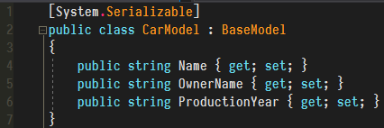

# Item Creator
### Extension is under development and is not ready to use yet!

### Description
Item Creator is a Unity extension that enables user to easly create his items data and save it to `json` file (there are plans for creating extension that will enable to browse already created items and delete them (base CRUD operations)).

### Model code
This is how you express your model in code (`BaseModel` class is delivered with plugin and it is required that your model class inherits from it)

### Inspector look
After you create model just drag and drop script on proper object field and rest fields will generate automatically based on model class properties. After you hit `Create item` button `Item Creator` will generate json representation of that model. For now it is not saved anywhere yet.

### Development
I am using Unity 2017.1 along with Visual Studio 2017 Community Edition with experimanetal C# 6 support (I am using string interpolation inside).

### Usage
First you need to create a script that will include public class which will be `[System.Serializable]` (this is necessary in order to be able to read class properties). Then you just need to drag a script into the specified field and *vuala*. In order to create item and append it to your destination file click `Create item` button.

### Third party libraries
* [LitJson](https://lbv.github.io/litjson/)
